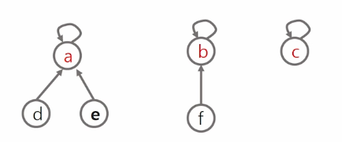

# 서로소 집합(상호배타 집합)
> ## 표현 방법
> - 연결리스트
> - 트리
>
> ## 상호배타 집합 연산
> - Make-Set(x) : 초기 설정
> - Find-Set(x) : 대표자가 누구니?
> - Union(x)    : 같은 집합으로 묶어주자
> <br>
> <br>

## 상호배타집합 표현 - 연결리스트
- 같은 집합의 원소들은 하나의 연결리스트로 관리한다.
- 연결리스트의 맨 앞의 원소를 집합의 대표 원소로 삼는다.
- 각 원소는 집합의 대표 원소를 가리키는 링크를 갖는다.

## 상호배타집합 표현 - 트리
- 하나의 집합을 하나의 트리로 표현한다.
- 자식 노드가 부모 노드를 가리키며 루트 노드가 대표자가 된다.

- Make-Set(x) : 유일한 멤버 x를 포함하는 새로운 집합을 생성하는 연산. 자기 자신을 대표자로 선정.
- Find-Set(x) : x를 포함하는 집합을 찾는 연산. 자기 자신이 대표라면 자기 자신을 return, 아니라면 Find-Set(부모)
- Union(x,y) : x와 y를 포함하는 두 집합을 통합하는 연산. 대표자끼리 합치는 것. y의 대표자를 x의 대표자와 동일하게 함.


## 파이썬으로 구현
```py
'''
6 8
0 1 2
0 2 4
1 2 1
1 3 7
2 4 3
3 4 2
3 5 1
4 5 5
'''

import heapq

INF = int(1e9)  # 무한을 의미하는 값으로 1억

# 노드의 개수, 간선의 개수를 입력받기
n, m = map(int, input().split())
# 시작 노드 번호 (문제에 따라 다름)
start = 0
# 인접리스트 만들기
graph = [[] for i in range(n)]
# 누적거리를 저장할 테이블 - INF 로 저장
distance = [INF] * n

# 간선 정보를 입력
for _ in range(m):
    a, b, w = map(int, input().split())
    graph[a].append([b, w])  # 단방향 그래프이다!


def dijkstra(start):
    pq = []
    # heapq 에 리스트로 저장할 때는 맨 앞의 데이터를 기준으로 정렬된다.
    heapq.heappush(pq, (0, start))
    distance[start] = 0  # 시작 노드 최단 거리는 0

    # 우선순위 큐가 빌 때 까지 반복
    while pq:
        # 가장 최단 거리인 노드에 대한 정보 꺼내기
        dist, now = heapq.heappop(pq)
        # 현재 노드가 이미 처리됐다면 skip
        # 예제 그림: c 위치 가중치 3, 4 로 도착가능 [참고]
        if distance[now] < dist:
            continue

        # 현재 노드와 연결된 다른 인접한 노드 확인
        for next in graph[now]:
            next_node = next[0]
            cost = next[1]  # 다음 노드의 가중치

            new_cost = dist + cost  # 누적값(현재까지의 누적값 + 다음 노드 가중치)

            # 다음 노드를 가는 데 더 많은 비용이 드는 경우
            if new_cost >= distance[next_node]:
                continue

            distance[next_node] = new_cost  # next_node 까지 가는데 비용은 new_cost
            heapq.heappush(pq, (new_cost, next_node))


# 다익스트라 알고리즘 실행
dijkstra(start)

# 모든 노드로 가기 위한 최단 거리 출력
for i in range(n):
    # 도달할 수 없는 경우, 무한 출력
    if distance[i] == INF:
        print("INF", end=' ')
    else:
        print(distance[i], end=' ')

# 0 2 3 9 6 10 출력의 의미
# -> 0번 노드에서 갈 수 있는 다른 노드들까지의 최단거리들을 모두 구할 수 있다.
# - 다익스트라 한 번이면, 하나의 정점 -> 다른 정점들까지의 최단거리들을 모두 구한다.


```

## 활용 - 그래프는 이미 연결된 노드끼리 또 연결할 경우 cycle이 발생함. **cycle을 찾을 때 union-find를 이용할 것.**