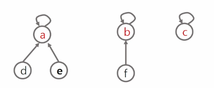

# 서로소 집합(상호배타 집합)
> ## 표현 방법
> - 연결리스트
> - 트리
>
> ## 상호배타 집합 연산
> - Make-Set(x) : 초기 설정
> - Find-Set(x) : 대표자가 누구니?
> - Union(x)    : 같은 집합으로 묶어주자
> <br>
> <br>

## 상호배타집합 표현 - 연결리스트
- 같은 집합의 원소들은 하나의 연결리스트로 관리한다.
- 연결리스트의 맨 앞의 원소를 집합의 대표 원소로 삼는다.
- 각 원소는 집합의 대표 원소를 가리키는 링크를 갖는다.

## 상호배타집합 표현 - 트리
- 하나의 집합을 하나의 트리로 표현한다.
- 자식 노드가 부모 노드를 가리키며 루트 노드가 대표자가 된다.

- Make-Set(x) : 유일한 멤버 x를 포함하는 새로운 집합을 생성하는 연산. 자기 자신을 대표자로 선정.
- Find-Set(x) : x를 포함하는 집합을 찾는 연산. 자기 자신이 대표라면 자기 자신을 return, 아니라면 Find-Set(부모)
- Union(x,y) : x와 y를 포함하는 두 집합을 통합하는 연산. 대표자끼리 합치는 것. y의 대표자를 x의 대표자와 동일하게 함.


## 서로소 집합 - BASIC
```py
def make_set(n):
    p = [i for i in range(n)]  # 각 원소의 부모를 자신으로 초기화
    return p


def find_set(x):
    if parents[x] == x:  # x 자기자신이 x 를 바라본다 == 해당 집합의 대표자를 찾았다
        return x

    # x의 부모가 가리키고 있는 정점부터 다시 대표자를 탐색
    return find_set(parents[x])

def union(x, y):
    # x 와 y 의 대표자를 찾자.
    root_x = find_set(x)
    root_y = find_set(y)


    if root_x == root_y:  # 이미 같은 집합이면 할 필요가 없으니 끝.
        return

    # 다른 집합이라면 더 작은 루트노트(# 문제에 따라 다르다)에 합친다.
    if root_x < root_y:
        parents[root_y] = root_x  # y 가 바라보는 부모는 x 의 대표자
    else:
        parents[root_x] = root_y


# 예제 사용법
n = 7  # 원소의 개수
parents = make_set(n)  # 집합생성. parents 에 부모 정보들을 저장

union(1, 3)
union(2, 3)
union(5, 6)

print(parents)  
'''
[0, 1, 1, 1, 4, 5, 5] 
# 대표자의 수 (1 4 5 : 3개) == 집합의 수
'''

print('find_set(6) = ', find_set(6))

target_x = 2
target_y = 3

# 원소 2과 원소 3가 같은 집합에 속해 있는지 확인
if find_set(target_x) == find_set(target_y):
    print(f"원소 {target_x}과 원소 {target_y}는 같은 집합에 속해 있습니다.")
else:
    print(f"원소 {target_x}과 원소 {target_y}는 다른 집합에 속해 있습니다.")

```
### 문제점
- Find-set()에서 부모를 타고 올라가는 과정이 비효율적임.
- 연산의 효율을 높이는 방법
  - Path compression(경로 압축)
    - Find-set을 행하는 과정에서 만나는 모든 노드들이 **직접 root를 가리키도록** 포인터를 바꾸어 준다.
  - Rank를 이용한 Union
    - 각 노도는 자신을 루트로 하는 subtree의 높이를 Rank 라는 이름으로 저장한다.
    - 두 집합을 합칠 때 rank가 낮은 집합을 rank가 높은 집합에 붙인다.

## 서로소 집합 - Rank, Path compression 활용
```py
def make_set(n):
    p = [i for i in range(n)]   # 각 원소의 부모를 자신으로 초기화
    r = [0] * n                 # 시작 rank 는 모두 0으로 초기화
    return p, r


def find_set(x):
    # 원소의 부모가 자기자신이다 == 자기가 그 그룹의 대표자
    if parents[x] == x:
        return x

    # 경로 압축 (path compression)을 통해 부모를 루트로 설정
    # parents[x]  # x 가 가리키고 있는 부모
    # find_set(parents[x])  # x 의 부모로부터 대표자를 찾아와라.
    parents[x] = find_set(parents[x])
    return parents[x]


def union(x, y): # 누구를 움직여서 합칠 것인가? 더 작은 트리를 붙이는 편이 좋음.
    root_x = find_set(x)
    root_y = find_set(y)

    if root_x == root_y:  # 이미 같은 집합이면 끝
        return

    # rank를 비교하여 더 작은 트리를 큰 트리 밑에 병합
    if ranks[root_x] > ranks[root_y]:
        parents[root_y] = root_x
    elif ranks[root_x] < ranks[root_y]:
        parents[root_x] = root_y
    else:
        # rank가 "같으면" 한쪽을 다른 쪽 아래로 병합하고 "rank를 증가"시킴
        parents[root_y] = root_x
        ranks[root_x] += 1


# 예제 사용법
n = 7  # 원소의 개수
parents, ranks = make_set(n)

union(1, 3)
union(2, 3)
union(5, 6)

print('find_set(6) = ', find_set(6))

target_x = 2
target_y = 3

# 원소 1과 원소 2가 같은 집합에 속해 있는지 확인
if find_set(target_x) == find_set(target_y):
    print(f"원소 {target_x}과 원소 {target_y}는 같은 집합에 속해 있습니다.")
else:
    print(f"원소 {target_x}과 원소 {target_y}는 다른 집합에 속해 있습니다.")

```

## 활용 - 그래프는 이미 연결된 노드끼리 또 연결할 경우 cycle이 발생함. **cycle을 찾을 때 union-find를 이용할 것.**